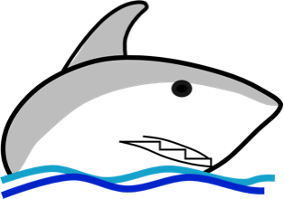

[](http://www.janelia.org)

##DESCRIPTION
Shark Viewer is a web-based viewer for swc neuron files. It is written entirely in javascript using three.js.
To view swc format guidelines visit: http://research.mssm.edu/cnic/swc.html

##QUICK START
1) Load javascript files onto page
```
<script src="js/threejs/three.js"></script>
<script src="js/threejs/TrackballControls.js"></script>
<script src="js/shark_viewer.js"></script>
```
2) Load a swc file into json. There is a helper function swc_parser(swc_text) available, or you can write your own to process it server side and load via AJAX.
```
var  swc = swc_parser(document.getElementById("swc").text);
```
3) Create a new shark viewer object. At a minimum you need to give it the swc json and a DOM element to attach a canvas to.
```
var s = new SharkViewer({ swc: swc, dom_element: 'container' });
```
4) Initialize the shark viewer
```
s.init();
```
5) Animate the shark viewer
```
s.animate();
```

Shark_Viewer.html shows an example of this setup.

```
swc json object:
               { id : {
                       type: <type number of node (string)>,
                       x: <x position of node (float)>,
                       y: <y position of node (float)>,
                       z: <z position of node (float)>,
                       parent: <id number of node's parent (-1 if no parent)>,
                       radius: <radius of node (float)>,
                       }
               }
```

##OPTIONS
swc - swc neuron json object
*Default*:  {}

dom_element - html element that will receive webgl canvas
*Default*: 'container'

mode - sphere (full 3-D rendering for nodes and connections, slow), particle (uses particle system to speed rendering and make it look better), or skeleton (no nodes, just connections, very fast)
*Default*: 'particle'

HEIGHT - height of canvas
*Default*: window.innerHeight

WIDTH - width of canvas
*Default*: window.innerWidth

center_node - which node to center neuron on (starts at 1), -1 to center at center of bounding box
*Default*: 1

show_stats - shows fps rendering stats if true
*Default*: false

effect - Renders using effects to allow viewing with specialized equipment: noeffect (none), parallax (parallax barrier), rift (oculus rift)
*Default*: 'noeffect'

show_cones - show cones between cylinders for particle and sphere mode
*Default*: true;

colors - color array for display, nodes of type 0 show as first color, etc.
*Default*:  [
	0x00be9e,
	0x3919cb,
	0x7d0bc4,
	0xff6700,
	0x3eef00,
	0xffce00,
	0xf50027,
	0x606060,
]

metadata - array of javascript objects with labels and type numbers to display as legend (type number matches to type column in swc file)  format:
*Default*: false
Example:
```
[{"label":"undefined","type":0},{"label":"soma","type":1}]
```

##Author Information
SharkViewer was written by Charlotte Weaver (<weaverc10@janelia.hhmi.org>) and Christopher Bruns (<brunsc@janelia.hhmi.org>)

[Scientific Computing](http://www.janelia.org/research-resources/computing-resources)  
[Janelia Farm Research Campus](http://www.janelia.org)  
[Howard Hughes Medical Institute](http://www.hhmi.org)
